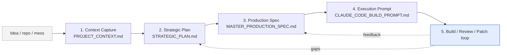
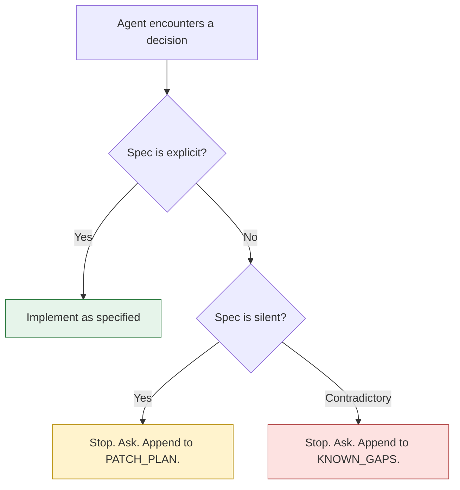

> [!summary]
> If your AI-coding workflow is "type idea → paste into agent → fix what's wrong," you're paying the agent to invent every product decision you didn't make. This piece describes a five-document pipeline I keep in a `/specs` folder for serious projects. It's slower at the front and dramatically faster everywhere else — and unlike prompt-engineering tricks, it survives model upgrades because it doesn't depend on a particular model's quirks.

## The shortcut that isn't

The dominant pattern looks like this:

```
idea → big prompt → generated code → fix → re-prompt → fix → …
```

It feels fast because the first iteration ships in minutes. Then you spend the next three days reverse-engineering what the model decided when you weren't watching — schema choices, auth assumptions, environment variables it picked names for, error semantics it invented. Each fix loop re-introduces drift somewhere else.

The cheaper path takes one extra day at the start:



Each document answers exactly one question and *refuses* to answer the others. That refusal is the whole trick.

## Layer 1 — Context Capture

**Question answered:** what is true today?

**Document:** `PROJECT_CONTEXT.md`

Contents: what the project is, who it's for, the current stack, the current status, known issues, constraints, dependencies, infra, the existing data model, deployment method, **and the non-goals**. That last one is the cheapest sentence you can write and the most expensive one to omit.

**Failure mode if you skip it:** the model "helpfully" rewrites the parts that aren't broken. You spent two hours fixing the part you asked about and three hours undoing what it did to everything else.

> The rule: *if the context is weak, the rest will be fiction with markdown lipstick.*

## Layer 2 — Strategic Plan

**Question answered:** what should change, and why?

**Document:** `STRATEGIC_PLAN.md`

Contents: business goal, user value, scope, future-state architecture, priorities, implementation phases, migration path, risks. **Not** every table, endpoint, or env var — that comes later. The strategic plan is where you choose direction; it's not where you choose how to spell variable names.

**Failure mode if you skip it:** you make engineering choices that look fine in isolation and unwind a product decision you forgot you'd made.

## Layer 3 — Production Spec

**Question answered:** exactly how should this be built?

**Document:** `MASTER_PRODUCTION_SPEC.md`

This is the engineering truth document. Architecture diagram, schema with migrations, API contracts, auth model, RLS or tenancy rules, env vars, background jobs, queue behaviour, storage design, logging, analytics hooks, testing requirements, CI/CD expectations, rollback and failure modes, and the **definition of done**.

The litmus test: *if something matters in production, it belongs here.* If a teammate would need to ask "what happens when X fails?" — the answer lives in this file.

**Failure mode if you skip it:** the agent invents reasonable-looking defaults that diverge from the rest of your system. They're not wrong; they're just *yours-but-different*. Six months later you can't remember why two services use different error codes.

## Layer 4 — Execution Prompt

**Question answered:** how does the agent operate?

**Document:** `CLAUDE_CODE_BUILD_PROMPT.md`

The execution prompt **orchestrates**; it does not restate the spec. It tells the agent:

- The mandatory reading order (context → plan → spec).
- Which document is source-of-truth for each kind of question.
- Implementation order (which phases first; what's behind a flag).
- Guardrails (no destructive git, no schema drift without a migration, no unattributed env vars, etc.).
- What to do when the spec contradicts itself — stop and ask, not guess.

The temptation is to inline the whole production spec into the prompt. Don't. A prompt that repeats the spec means the prompt and the spec drift apart silently. Reference the spec; trust the reading order.

## Layer 5 — Build / Review / Patch loop

**Question answered:** what actually got built?

**Documents:** `BUILD_REVIEW.md`, `PATCH_PLAN.md`, `KNOWN_GAPS.md`

After every meaningful build pass, write three short documents:

| File | Captures |
| --- | --- |
| `BUILD_REVIEW.md` | What was implemented, what was skipped, what was hallucinated, what broke existing behaviour, what's still risky. |
| `PATCH_PLAN.md` | The ordered list of fixes that need to land before this build is considered shipped. |
| `KNOWN_GAPS.md` | What manual intervention is still required, with owner and deadline. |

> The rule: *first-pass AI output is usually usable. It is rarely sacred.*

## The shape of `/specs`

```
.
└── specs/
    ├── 00_PROJECT_INTAKE.md         ← the form you fill out once
    ├── 01_PROJECT_CONTEXT.md        ← Layer 1
    ├── 02_STRATEGIC_PLAN.md         ← Layer 2
    ├── 03_MASTER_PRODUCTION_SPEC.md ← Layer 3
    ├── 04_CLAUDE_CODE_BUILD_PROMPT.md ← Layer 4
    ├── 05_BUILD_REVIEW.md           ← Layer 5
    ├── 06_PATCH_PLAN.md             ← Layer 5
    ├── 07_KNOWN_GAPS.md             ← Layer 5
    └── 08_CHANGELOG_AI.md           ← what the agent did, with reasons
```

Optional companions: `UI_REFERENCE.md`, `SECURITY_REQUIREMENTS.md`, `SEO_REQUIREMENTS.md` — same idea, narrower scope.

## With and without

```text
┌─────────────────────────┬─────────────────────────┐
│ Without /specs          │ With /specs             │
├─────────────────────────┼─────────────────────────┤
│ "Build me an X."        │ Read 01-04, then build  │
│ Model invents schema    │ Model implements schema │
│ Model invents auth      │ Model implements auth   │
│ You discover divergence │ You catch it in review  │
│ Fix loop:  hours        │ Fix loop:  minutes      │
│ Memory:  in your head   │ Memory:  in the repo    │
└─────────────────────────┴─────────────────────────┘
```

## Ambiguity, handled

The single rule that turns this from "documentation theatre" into a working process: **the agent stops at ambiguity. It does not guess.**



The strategic plan asked once; the production spec asked harder; the execution prompt installed the stop-rule. The build / review / patch loop turns *stops* into *changes to the spec* — which is the only place a permanent decision should ever live.

## Why this beats "better prompts"

Better prompts are model-shaped. They exploit a particular agent's quirks: the wording that gets Claude to follow instructions more literally, the tokens that bias toward smaller diffs, the system-prompt hacks that shift behaviour. Those tricks decay every release.

Specs are *project*-shaped. They survive model upgrades because they describe the world the code lives in, not the agent that wrote it. When a new model comes out, you swap the agent and keep the specs. When a new teammate joins, they read the specs and skip three days of catch-up.

The shortcut was always going to cost you somewhere. Spec engineering is where you pay.

---

*Related: a copy-paste operating manual for getting Claude Code to behave with the `/specs` pattern is in [[a-copy-paste-operating-manual-for-claude-code]] (forthcoming).*
